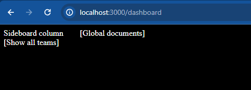
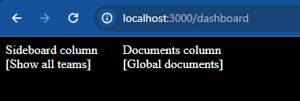
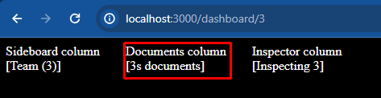

A potential issue with NextJS 14's parallel routes.

## Anatomy of the routes 
```
app/
  dashboard/
    default.tsx
    layout.tsx
    
    @documents/
      [teamId]/
        page.tsx
      layout.tsx
      page.tsx
      
    @inspector/
      [teamId]/
        page.tsx
        layout.tsx
      default.tsx
      
    @sideboard/
      [teamId]/
        page.tsx
      layout.tsx
      page.tsx
```

In this tree, `default.tsx` always returns `null`.

## What is the issue?

When navigating to `/dashboard` the page looks like this:



When following is expected:



The layout `dashboard/@documents/layout.tsx` is not applied when no `teamId` is given.
Only when that identifier is given as a dynamic route segment, the layout is actually 
applied:



## Is this nominal?
This behaviour seems not to be what it is supposed to be, since our `@sideboard` 
layout is behaving like it should, even tho this route has basically the equivalent 
anatomy to our `@documents` route.